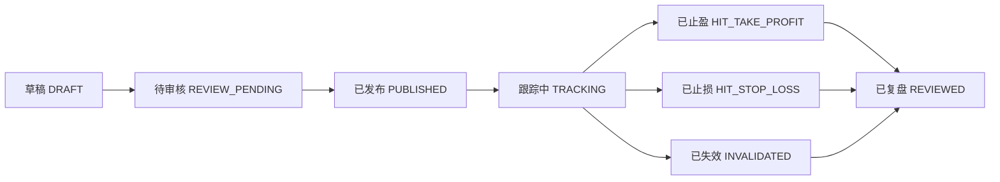

# 阶段0：画布与真相源

最后更新: 2026-03-16
状态: Done

## 阶段目标

在写功能前，统一以下三类真相源：
- 用户路径画布
- 页面结构画布
- 推荐生命周期状态流

## 阶段结论

阶段0的输出已经足够支撑后续开发，后续阶段统一按以下原则推进：
- 首页负责回答“今天该看什么”
- 推荐档案页负责回答“为什么推荐、何时失效、后续怎么看”
- 历史档案页负责建立信任
- 我的关注页负责建立回访理由
- 后台负责管理推荐从创建到复盘的完整生命周期

## 为什么先做这一步

当前系统功能已不少，但前台叙事、后台运营、转化路径还没有被一套统一画布串起来。阶段0的目标是避免后续开发边做边改方向。

## 用户路径画布

### 路径一：游客首次访问

目标：5 秒内理解网站价值，并愿意点击一次。

用户进入首页后，应先看到：
- 今日主推荐
- 今日观察清单
- 市场一句话判断
- 一条强 CTA：查看完整逻辑 / 注册获取更多推荐

游客阶段要完成的不是转化付费，而是完成第一次“有价值点击”。

### 路径二：注册用户二次访问

目标：让用户从“看推荐”升级为“跟推荐”。

注册用户进入后，应获得：
- 更完整的推荐逻辑
- 历史推荐档案的更多内容
- 收藏/关注能力
- 我的关注页入口

这个阶段的关键不是收费，而是形成使用习惯。

### 路径三：回访用户形成习惯

目标：让用户每天都有固定理由回来。

回访用户应被固定内容节奏驱动：
- 08:30 看今日重点推荐
- 11:30 看午盘变化
- 15:30 看收盘复盘
- 周末 看下周关注方向

这个阶段的关键是从“偶尔来看”变成“按节奏来看”。

### 路径四：会员用户持续付费

目标：让会员感到省时间、可跟踪、值得续费。

会员应获得：
- 更完整推荐池
- 更频繁的盘中变化
- 更完整的风险说明与复盘
- 更清晰的个人关注更新

会员价值的核心不是“更多股票”，而是“更连续的决策辅助”。

## 用户路径总表

| 用户阶段 | 核心问题 | 入口页面 | 关键价值 | 主要动作 | 进入下一阶段条件 |
| --- | --- | --- | --- | --- | --- |
| 游客 | 今天看什么 | 首页 | 快速感知价值 | 点进推荐详情/注册 | 完成首次高意图点击 |
| 注册用户 | 为什么推荐 | 首页/推荐档案页 | 获取完整逻辑 | 收藏、关注、查看历史 | 开始形成连续访问 |
| 回访用户 | 今天哪些内容有变化 | 我的关注/首页 | 节奏化更新 | 回看跟踪、阅读复盘 | 形成固定回访 |
| 会员用户 | 是否值得续费 | 我的关注/推荐档案页 | 连续决策辅助 | 查看完整池、盘中更新 | 获得稳定使用收益 |

## 页面画布

### 首页：今日决策首页

页面使命：
- 回答“今天该看什么”
- 让游客也能快速感知价值
- 成为全站最高频访问入口

必备模块：
- 今日主推荐
- 今日观察清单
- 市场一句话判断
- 热点资讯联动
- 注册/会员 CTA

主要 CTA：
- 查看完整逻辑
- 保存到我的关注
- 获取今日更新

主要依赖：
- 股票推荐列表
- 推荐详情/表现
- 新闻数据
- 会员状态

### 推荐档案页

页面使命：
- 回答“为什么推荐、什么时候失效、后续怎么看”
- 建立推荐的解释性与可信度

必备模块：
- 推荐摘要
- 推荐逻辑
- 风险边界
- 失效条件
- 因子解释/方法说明
- 表现与基准
- 跟踪状态
- 相关资讯

主要 CTA：
- 保存关注
- 查看历史同类推荐
- 解锁完整跟踪/复盘

主要依赖：
- 推荐 detail
- insight
- performance
- benchmark
- related news

### 历史档案页

页面使命：
- 回答“你过去推荐过什么，结果如何”
- 承担全站信任建设职责

必备模块：
- 推荐时间线
- 状态筛选
- 结果标识
- 表现来源标识
- 复盘摘要

主要 CTA：
- 查看完整档案
- 注册查看更多记录
- 对比当前推荐与历史推荐

主要依赖：
- 历史推荐列表
- 推荐状态
- 表现来源标识

### 我的关注页

页面使命：
- 回答“我今天需要看哪些更新”
- 承担用户回访与留存职责

必备模块：
- 我关注的股票
- 今日状态变化
- 相关新闻变化
- 推荐更新记录

主要 CTA：
- 查看最新变化
- 跳转推荐档案页
- 开启会员获取更多更新

主要依赖：
- 收藏/关注关系
- 推荐状态变化
- 资讯联动

## 页面与职责总表

| 页面 | 首要职责 | 次要职责 | 核心指标 | 当前对应落点 |
| --- | --- | --- | --- | --- |
| 首页 | 价值感知 | 注册引导 | 首次点击率 | `/Users/gjhan21/cursor/sercherai/client/src/views/HomeView.vue` |
| 推荐档案页 | 解释推荐 | 建立信任 | 详情页停留时长 | `/Users/gjhan21/cursor/sercherai/client/src/views/StrategyView.vue` |
| 历史档案页 | 历史证明 | 注册转化 | 历史页点击率 | 新增页面 |
| 我的关注页 | 回访留存 | 会员转化 | 回访率/关注率 | 新增页面 |

## 推荐生命周期状态流

推荐状态从后台到前台，建议统一为以下状态流：

## 状态定义表

| 状态 | 对内含义 | 对前台是否可见 | 允许动作 | 说明 |
| --- | --- | --- | --- | --- |
| `DRAFT` | 草稿，尚未审核 | 否 | 编辑、删除、提交审核 | 仅运营内部可见 |
| `REVIEW_PENDING` | 待审核 | 否 | 审核通过、打回修改 | 防止直接把草稿发到前台 |
| `PUBLISHED` | 已发布，开始对外可见 | 是 | 开始跟踪、下线 | 用于初次发布当日 |
| `TRACKING` | 已进入跟踪期 | 是 | 更新状态、记录变化 | 前台重点展示状态 |
| `HIT_TAKE_PROFIT` | 达到止盈条件 | 是 | 进入复盘 | 明确推荐结果之一 |
| `HIT_STOP_LOSS` | 达到止损条件 | 是 | 进入复盘 | 明确推荐结果之一 |
| `INVALIDATED` | 推荐逻辑失效 | 是 | 进入复盘 | 不以盈亏表达，强调逻辑边界 |
| `REVIEWED` | 已完成复盘 | 是 | 归档 | 形成历史档案的重要状态 |

## 前后台职责分工

### 前台负责
- 呈现今日重点
- 解释推荐逻辑
- 呈现状态变化
- 承担信任建设与回访留存

### 后台负责
- 创建与审核推荐
- 发布推荐
- 跟踪推荐状态
- 复盘推荐结论
- 为前台提供可解释、可追踪数据

## 阶段边界与依赖

### 阶段1输入
- 本文档中的首页使命、模块、CTA 与依赖
- 首页只回答“今天看什么”，不提前做历史档案或我的关注

### 阶段2输入
- 本文档中的推荐档案页职责、模块与信任目标
- 推荐档案页优先做逻辑/风险/跟踪结构

### 阶段3输入
- 本文档中的历史档案定位与状态流
- 历史档案页必须和状态定义保持一致

### 阶段4输入
- 本文档中的“我的关注页”定位与回访机制
- 关注逻辑必须服务留存，不提前扩张复杂社交能力

### 阶段5输入
- 本文档中的生命周期状态流与字段方向
- 后台必须先支持状态治理，前台才能长期可信演进

### 阶段6输入
- 本文档中的用户阶段与页面职责
- 权益边界要服务转化，不打乱前面已建立的产品节奏

## 开发前阅读清单

开始阶段1之前，必须重新阅读：
- `docs/vibe-stock-growth/README.md`
- `docs/vibe-stock-growth/开发工作流.md`
- `docs/vibe-stock-growth/阶段0-画布与真相源.md`
- `docs/vibe-stock-growth/阶段1-今日决策首页.md`

## 验收标准

- 团队可以只靠文档讲清楚整个改造方向
- 后续每个阶段都能找到自己的输入与输出
- 阶段1到阶段6的边界明确，不交叉失控
- 用户路径、页面画布、状态流已经落成可执行稿

## 当前状态

- 已完成阶段0执行稿

## 已完成

- 明确四类用户阶段及转化关系
- 明确四类核心页面的使命、模块与 CTA
- 明确推荐生命周期状态流与前后台职责分工
- 明确后续六个阶段的输入边界

## 偏差说明

- 状态字段命名仍是建议稿，真正落库时可按现有表结构微调

## 遗留问题

- 阶段1开始前还需进一步确认首页视觉层级与具体文案
- 历史档案与我的关注页的技术实现路径要在后续阶段细化

## 进入下一阶段条件

- 阶段1以本文档为真相源开始开发

